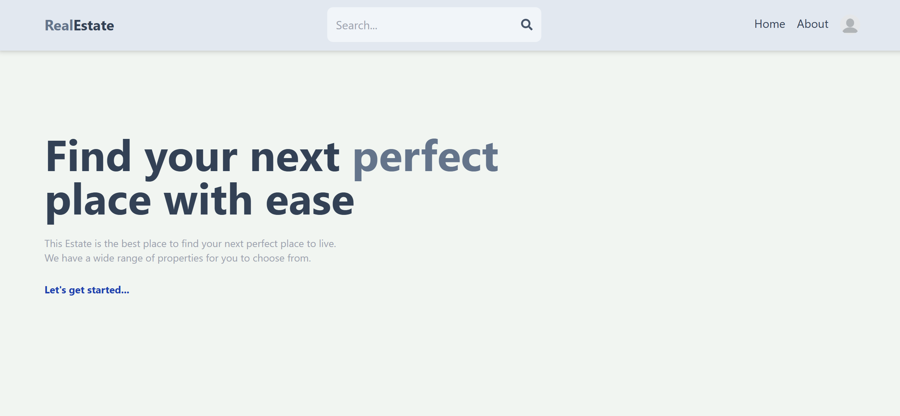
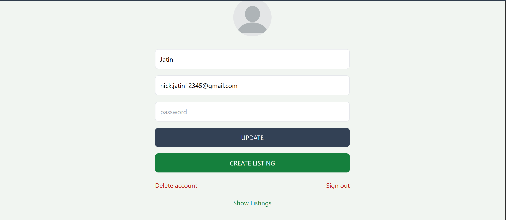
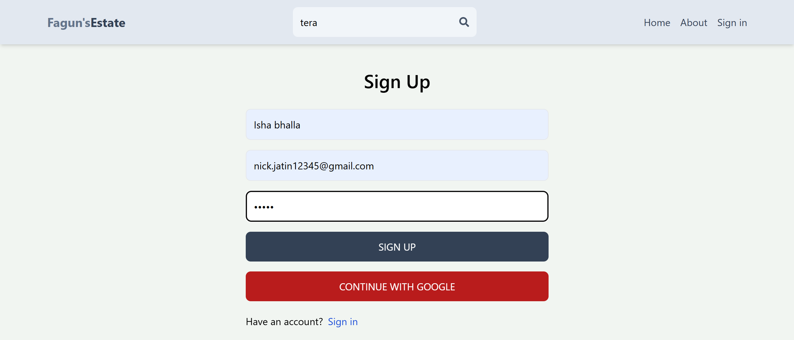
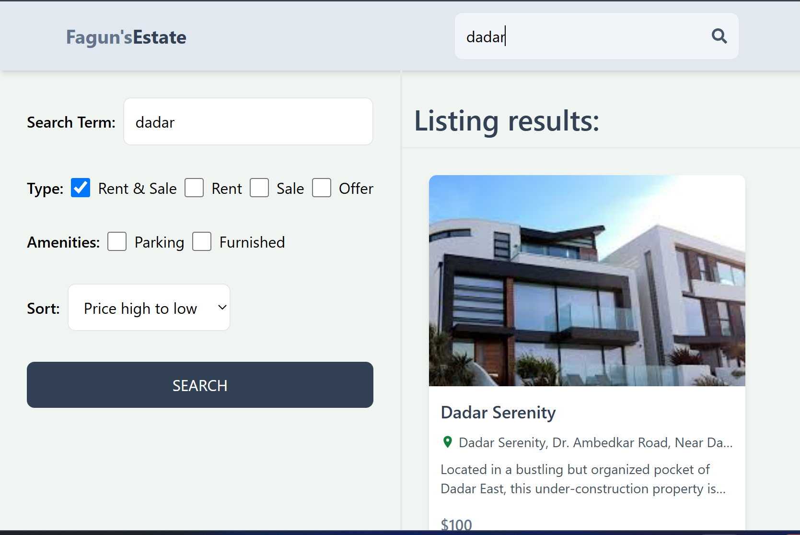
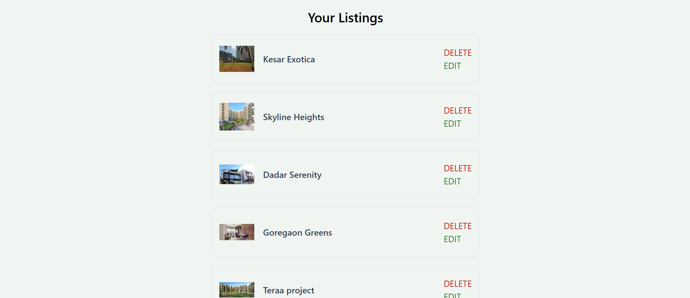
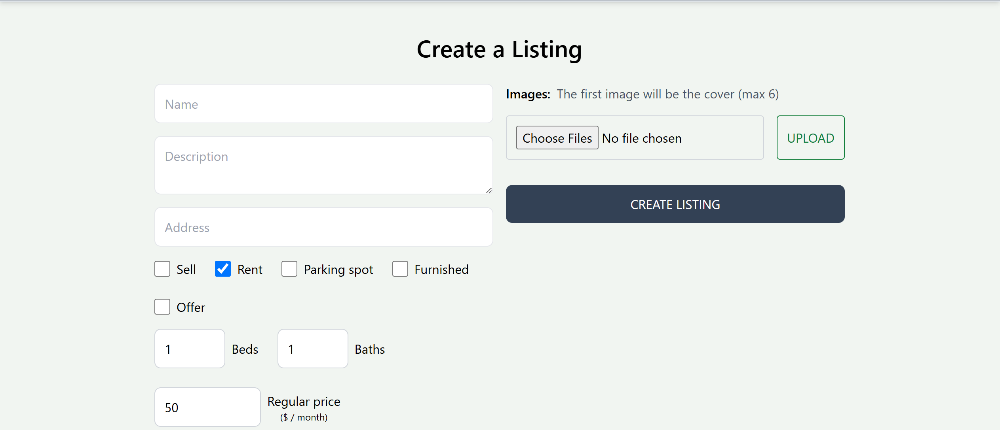
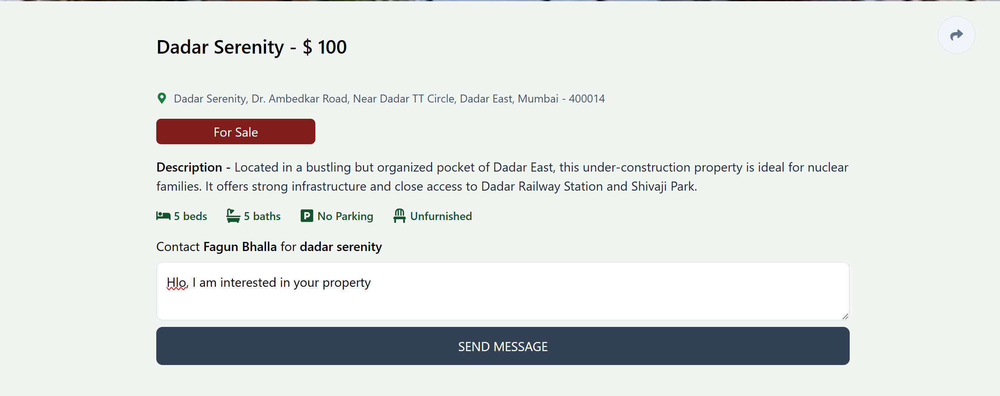
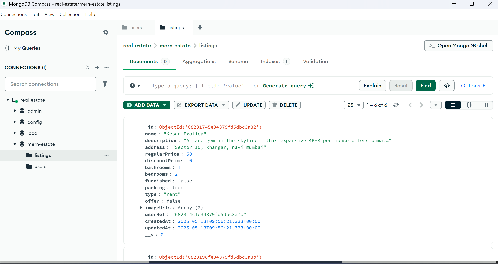

# MERN Real Estate

Developed a real-time MERN stack web app for buying, selling, and searching properties with location-based filtering, dynamic listings, CRUD functionality, and responsive design. Demonstrated skills in full-stack development, RESTful APIs, and MongoDB data management.

---

## 🚀 Features

🔐 **User Authentication & Authorization**  
Secure login and signup using JWT tokens and protected routes.

🏠 **Property Listings**  
Create, update, and delete property listings for buying, selling, or renting.

🔎 **Advanced Search**  
Filter listings by location, price, offer type, and property category.

🎨 **Modern UI**  
Sleek, responsive design using React and Tailwind CSS.

🖼️ **Image Uploads**  
Upload and display property images (supports Firebase/Cloudinary integration).

📨 **Contact Seller**  
Direct messaging feature to communicate with listing owners.

📊 **Dashboard Management**  
Personalized dashboard for users to manage their properties.

🔔 **Real-Time Notifications**  
Instant toast alerts for actions like login, listing updates, or errors.

📱 **Fully Responsive Design**  
Optimized for desktops, tablets, and mobile devices.

---

# 📸 Demo & Screenshots

### 🏠 Dashboard
Main landing page where users can explore featured properties.

---

### 🔐 Login / Signup

#### Login Page

#### Signup Page

---

### 🔎 Property Search & Filters
Users can filter listings based on location, price range, category, and offer type.

---

### 🏡 Property Details Page
Detailed information about the selected property including images, price, description, and contact option.

---

### ➕ Create Property Listing
Users can add new property listings with images and property details.

---

### 📊 User Dashboard
Users can manage their listings including editing or deleting them.

---

### 🖼️ Image Upload Feature
Property images can be uploaded and displayed using Cloudinary or Firebase.

---

### 📱 Connects With Property Owner
Automatically redirected to the mail of owner of property.

---

### 🗄️ Database

---

## 🛠️ Tech Stack

### 💻 Frontend
- ⚛️ **React.js** – Component-based UI  
- 💨 **Tailwind CSS** – Utility-first CSS framework  
- 📦 **React Router** – Client-side routing  
- 🔔 **React Toastify** – Notifications and alerts  

### 🌐 Backend
- 🟢 **Node.js** – Runtime environment  
- 🚂 **Express.js** – Web framework for Node.js  
- 🔐 **JWT (jsonwebtoken)** – Authentication  
- 🗄️ **MongoDB Atlas** – Cloud database  
- 🧰 **Mongoose** – ODM for MongoDB  

### 🧰 Tools
- 🐙 **GitHub** – Version control  
- 🔁 **Postman** – API testing
